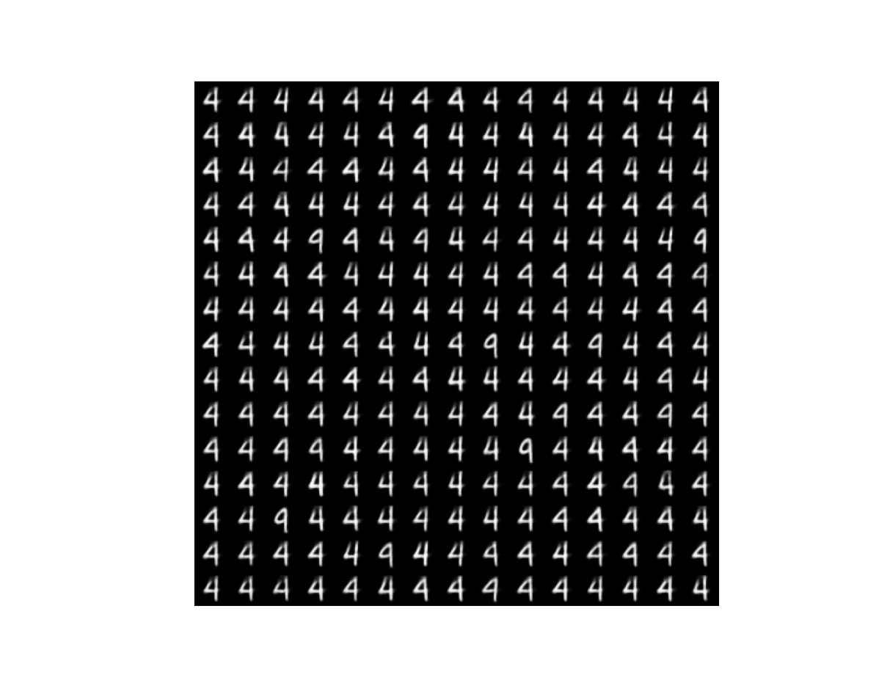
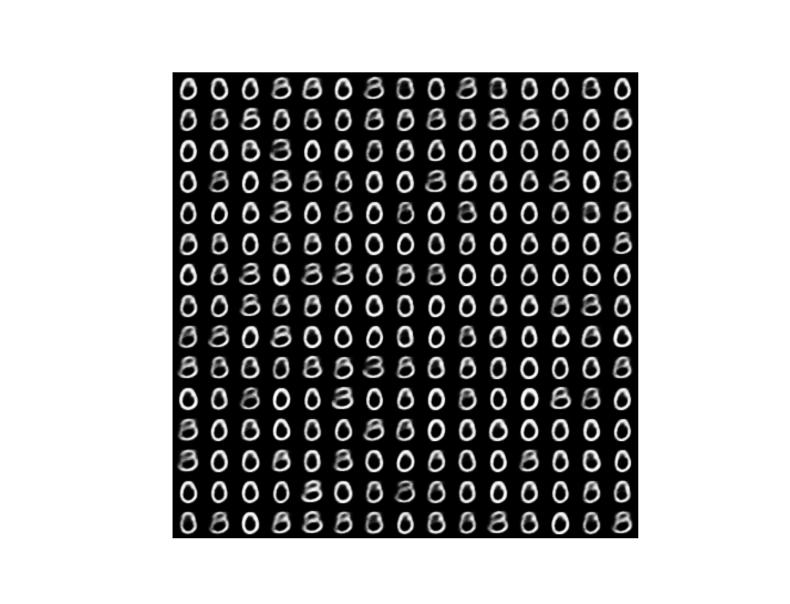

# Partial VAE
<B>Implementation</B>

My code in <a href=partial_vae.py>partial_vae.py</a> is implemented in TensorFlow 2.7.0 directly from the paper (<a href=https://arxiv.org/abs/1809.11142>Ma et al. 2019</a>).

The Partial VAE is trained on masked input data so as to be able to impute missing values for incomplete test data.  This system was trained on randomly masked MNIST digit data.  

Once trained it can be used to generate images from the prior, just as with an ordinary VAE.  The following images were generated by sampling randomly from N(0,I) over a 20 dimensional latent space:

To demonstrate the Partial VAE's ability to impute missing values, first choose a test-set image and then mask the top 60% of that image:

 

Then feed the obscured image, and its mask, to the Partial VAE to obtain the parameters of a normal distribution in latent space from which we can sample latent vectors and hence decode complete images consistent with the information in the obscured image that we supplied: 

Additional examples:

 

 

The TensorBoard validation loss curve obtained when training the above system is in <a href=TensorBoard.png>TensorBoard.png</a>.
