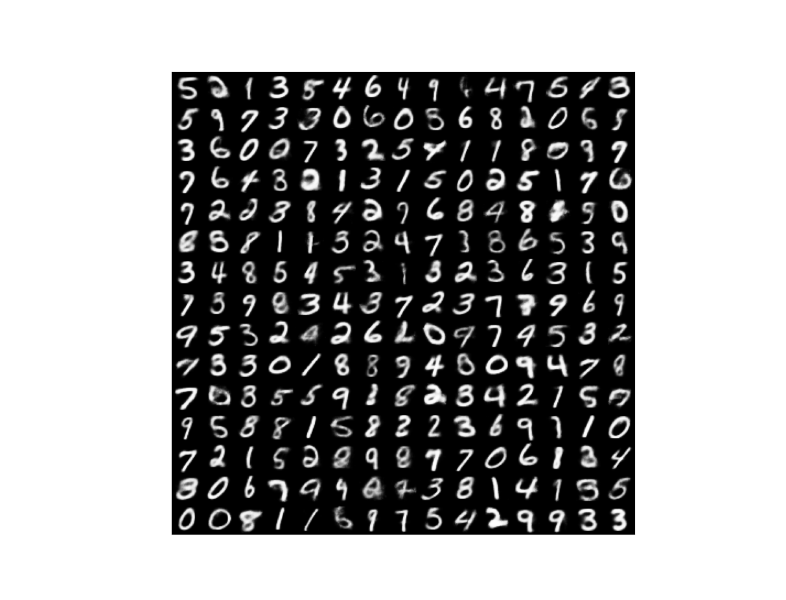

# Partial VAE
<B>Implementation</B>

My code is in <a href=partial_vae.py>partial_vae.py</a>, implemented in TensorFlow 2.7.0, directly from the paper (<a href=https://arxiv.org/abs/1809.11142>Ma et al. 2019</a>).

The Partial VAE is trained on masked input data so as to be able to impute missing values for incomplete test data.  This system was trained on randomly masked MNIST data.  

Once trained it can be used to generate images from the prior, just as with an ordinary VAE.  The following images were generated by sampling from N(0,I) over a 20 dimensional latent space:

To demonstrate the Partial VAE's ability to impute missing values, first choose a test-set image and then mask the top 60% of that image:

 

